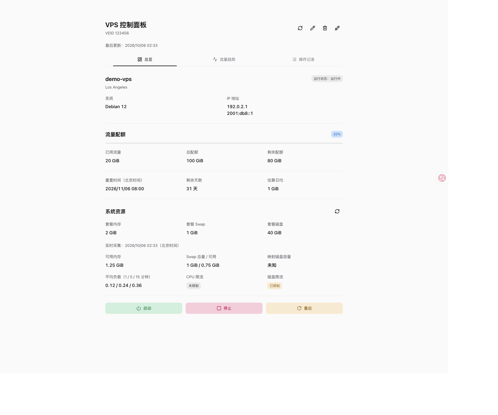
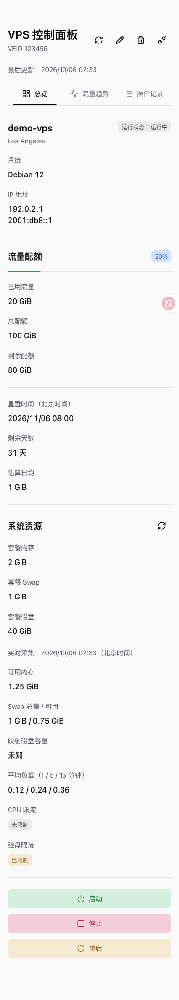

# bwg-usage

[![CI][ci-badge]][ci]
[![License: MIT][license-badge]](LICENSE)

中文 | [English](README.en.md)

**[在线体验：bwg-usage.vercel.app](https://bwg-usage.vercel.app/)**

[![Deploy to Vercel][vercel-button]][vercel-deploy]
[![Deploy to Cloudflare][cloudflare-button]][cloudflare-deploy]

可自行部署的搬瓦工 VPS 资源、流量与操作记录面板。
使用 React 19.3、vinext 1.0.1、TypeScript、HeroUI、Vite/Nitro，
支持 Vercel、Cloudflare Workers 和独立 Node 服务。

默认无需数据库、Redis 或环境变量，打开后填写自己的 VEID 与 API Key 即可连接。
API Key 会经过面板服务端调用 KiwiVM，请部署自己的实例或只使用可信的实例。
本项目与 BandwagonHost / KiwiVM 无隶属关系。

## 功能

- **资源总览**：流量配额、套餐内存/Swap/磁盘配置、可用内存、平均负载与限流状态。
- **流量趋势**：24 小时、7 天、30 天筛选，原始样本曲线、分页表格与 CSV 导出。
- **操作记录**：区分服务商审计与面板命令，按来源和结果筛选。
- **管理操作**：启动、停止与重启前确认目标，区分已受理、拒绝与结果未知。
- **连接管理**：浏览器保存可选，刷新自动验证并恢复，主动断开与清除配置分别处理。
- **访问保护**：可选应用密码、服务端固定目标和 Redis 分布式限流。

当前面向个人、单台 VPS；未提供多用户、后台告警、连接工具或恢复点管理。

## 界面



<details>
<summary>手机总览</summary>



</details>

截图使用合成 VPS 数据和保留地址，不包含真实凭证或服务器信息。

## 快速开始

需要 Node.js 22.13.0 或更新的 22.x，以及 [pnpm](https://pnpm.io/installation) 10.13.1。

```sh
git clone https://github.com/axin7/bwg-usage.git
cd bwg-usage
pnpm install --frozen-lockfile
pnpm dev
```

打开 `http://localhost:3000`，通过 [KiwiVM 控制面板](https://kiwivm.64clouds.com/)
登录自己的 VPS，进入 API 菜单获取 VEID 与 API Key。
开发服务器仅绑定本机；只在 development/test 的实际本机请求下跳过登录和限流。

默认勾选“在此设备保存 API Key”，验证成功后明文存入当前浏览器。
取消勾选可仅在页面内存中使用；请勿在共享设备保存密钥。
保存配置后刷新会自动验证并恢复，主动断开后当前标签页刷新仍保持断开。
旧版保存配置须明确复用；清除配置不等于撤销服务商 API Key。

## 部署

可先通过 [在线面板](https://bwg-usage.vercel.app/) 查看界面或用自己的凭证连接测试。
点击顶部部署按钮，登录对应平台并连接 Git 账号，确认新仓库和项目名称后部署。
Vercel 使用仓库的 `vercel.json`；Cloudflare 部署为 **Workers**，使用 `wrangler.jsonc`。
默认浏览器模式无需 VPS 密钥、面板密码、数据库或 Redis，部署后在页面填写凭证即可。

一键部署需要平台可读取的源码。当前源仓库仍为 Private；公开前，
拥有访问权的账号可手动导入，公共用户的一键部署入口须等仓库公开后才可使用。
手动部署、密码保护、固定目标、Redis 与各平台配置见 [部署说明](docs/DEPLOYMENT.md)。

| 命令 | 用途 |
| --- | --- |
| `pnpm dev` | 本机开发 |
| `pnpm check` | ESLint、类型检查、测试与 Node 生产构建 |
| `pnpm build` / `pnpm start` | 构建并运行独立 Node 服务 |
| `pnpm build:vercel` | 生成 Vercel Build Output |
| `pnpm verify:vercel` | 对已构建的 Vercel 产物执行离线集成验证 |
| `pnpm build:cloudflare` | 生成 Cloudflare Workers 产物 |
| `pnpm verify:cloudflare` | 对已构建的 Worker 执行离线集成验证 |
| `pnpm deploy:cloudflare` | 构建并通过 Wrangler 部署 Worker |

三种生产构建都包含服务端 API，不能作为纯静态站点或 Cloudflare Pages 静态目录发布。
`pnpm start` 不自动读取 `.env.local`，平台环境配置和本地 Node 启动方式见部署说明。
测试和集成验证使用模拟上游，不操作真实 VPS。

## 数据与安全

配额按服务商倍率修正，内部使用 bytes，页面使用 GiB。
日均为估算；平均负载不是 CPU 使用率，映射磁盘量不是文件系统剩余空间。
未知指标显示未知，读取失败保留上次成功数据并标记过期。

历史展示服务商实际提供的原始样本，不推算计费流量、实时速率或预测。
范围在面板端筛选，每个范围最多展示/导出最近 5,000 条；CSV 时间为 UTC。
页面时间为北京时间，样本缺失和间隔变化不补造为零。

普通查询约每 30 秒刷新，隐藏、离线或管理操作中暂停；失败逐步退避。
实时资源查询至多每 5 分钟自动执行一次，首次总览和手动刷新也会读取。
上游 live 响应可能耗时 15 秒；管理请求不自动重试，受理不证明操作完成。

浏览器模式默认无登录，Origin 检查不替代鉴权；默认限流仅在每实例内计数。
公网部署的访问保护、凭证存储边界和漏洞报告方式见 [安全政策](SECURITY.md)。
`vinext` 的 Nitro 集成为 beta；构建 glob 依赖仍有一个无补丁的高危告警，详见安全政策。
本地检查不能代替真实域名上的部署验收。

## 参与贡献

反馈问题或提出功能建议请使用 [Issues](https://github.com/axin7/bwg-usage/issues)。
贡献流程、模块说明和测试约定见 [CONTRIBUTING.md](CONTRIBUTING.md)。
安全问题私下报告，不在公开 Issue 中填写凭证或利用细节。

早期 [改进分析](docs/PROJECT_IMPROVEMENT_PLAN.md)、
[功能方案](docs/FEATURE_EXPANSION_PLAN.md) 与 [验收记录](docs/FEATURE_VALIDATION.md)
保留为开发历史；当前功能、默认行为和部署要求以本 README 及部署说明为准。

## 许可证

[MIT](LICENSE) © 2025–2026 axin7。第三方依赖按各自许可证使用。

[ci-badge]: https://github.com/axin7/bwg-usage/actions/workflows/check.yml/badge.svg
[ci]: https://github.com/axin7/bwg-usage/actions/workflows/check.yml
[license-badge]: https://img.shields.io/badge/License-MIT-green.svg
[vercel-button]: https://vercel.com/button
[vercel-deploy]: https://vercel.com/new/clone?repository-url=https://github.com/axin7/bwg-usage
[cloudflare-button]: https://deploy.workers.cloudflare.com/button
[cloudflare-deploy]: https://deploy.workers.cloudflare.com/?url=https://github.com/axin7/bwg-usage
