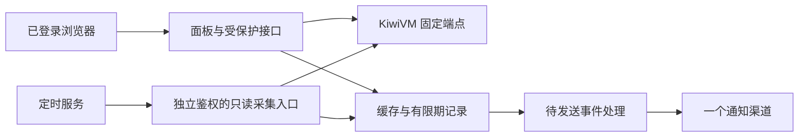

# 个人 VPS 运维面板功能扩展方案

日期：2026-10-05。基于当前 React 19.3、vinext、Vercel 与 KiwiVM 官方 API。
当前按单用户、单台 VPS 设计。本批开发范围已调整为 F01 资源概览、
F03 操作记录与 F04 原始流量趋势（含表格、CSV），验证结果以 README 为准。
用户已排除 F02 连接工具和 F08 恢复点列表；其余条目保留为后续候选。

## 1. 产品目标与当前基础

目标是帮助使用者回答四个问题：服务器是否受限、流量是否够用、最近发生了什么、能否恢复。

当前已经具备密码登录、服务端凭证、配额查看、手动刷新、启停确认、错误与过期数据提示。
缺少历史趋势、准确来源的资源诊断、可检索操作记录、无人值守通知与恢复工作流。

本批版本：资源概览 + 原始流量趋势 + 操作记录。
后台告警和快照写操作独立交付；第二台 VPS 出现后再扩展多实例。

## 2. 功能清单

P1 为下一版优先交付，P2 为依赖数据与调度的后续功能，P3 为按实际需求开启。

| ID | 功能 | 用户可完成的事情 | 数据/依赖 | 优先级 |
| --- | --- | --- | --- | --- |
| F01 | 资源概览 | 查看配置内存/磁盘、负载、可用内存/Swap、CPU/磁盘限速 | ServiceInfo 与 LiveServiceInfo | P1 |
| F02 | 连接工具 | 复制 IP、SSH 端口、连接命令，打开官方控制台 | IP 与 live 的 ssh_port | P1 |
| F03 | 操作记录 | 查看服务商审计；追踪面板命令的受理/拒绝/未知结果 | getAuditLog、有限期面板事件 | P1 |
| F04 | 流量趋势 | 查看实际支持的时间范围、流量曲线、有效区间增量、CSV | getRawUsageStats，先核对结构 | P1 |
| F05 | 用量规划 | 查看每日预算、近期消耗、预计用尽时间、是否撑到重置 | 兼容历史数据与有效配额 | P2 |
| F06 | 官方通知设置 | 查看、调整服务商实际提供的通知项目 | KiwiVM 通知偏好接口 | P1 |
| F07 | 后台告警 | 页面关闭后仍收到配额、预测和采集故障通知 | 服务端凭证、调度、Redis、单个通知渠道 | P2 |
| F08 | 恢复点列表 | 查看快照与自动备份、时间、大小、保留情况 | snapshot/list、backup/list | P1 |
| F09 | 快照创建 | 维护前创建快照，将自动备份复制为可恢复快照 | snapshot/create、backup/copyToSnapshot | P2 |
| F10 | 恢复与清理 | 选定恢复点，确认覆盖；管理 sticky 与删除 | snapshot/restore/delete/toggleSticky | P2，单独验收 |
| F11 | 控制台截图 | 排查启动错误，查看受保护的 VGA 静态截图 | live 的 screendump_png_base64 | P2 |
| F12 | 多 VPS | 切换目标、比较配额与状态，隔离各实例历史 | 服务端目标清单，实际第二台 VPS | P3 |
| F13 | 服务健康检查 | 查看固定网站/服务的响应时间与故障记录 | 固定 HTTP 目标或外部监控 | P3 |
| F14 | 高级管理 | 按需修改 Hostname/PTR，管理 ISO、迁移或重装 | 对应官方接口、影响确认 | P3 |
| F15 | 到期备注 | 手工登记续费日期与备注，再复用提醒机制 | 用户维护的数据，非流量重置时间 | P3 |

### 本批实际边界

- F01 使用基本与实时服务信息，普通轮询保留最近实时值和原采集时间。
- F03 服务商审计 + 面板命令，后者仅固定服务端目标跨会话保存，90 天/200 条。
- F04 调用原始统计接口后本地筛选 24 小时/7 天/30 天，展示实际可得样本。
- 已只读确认真实 `data` 统计数组和 `log_entries` 审计数组，保留最小字段。
- 尚未确认原始样本计数方式，不计算每日用量、区间增量、实时速率或配额预测。
- 数据缺失显示未知，间隔变化断开曲线并标明；CSV 包含单位、来源与原始样本语义。
- F02/F08 不开发；F05/F06/F07 及恢复写操作均未纳入本次交付。

以下页面与架构描述中的连接、通知、预测、恢复和调度内容是后续方案。

关键区别：

- `load_average` 是负载，不能写成 CPU 使用率；CPU% 须核对统计字段或另行采集。
- `ve_used_disk_space_b` 是映射磁盘量，不代表 VPS 内文件系统已用空间或剩余空间。
- `getUsageGraphs` 已废弃；使用 `getRawUsageStats`，不臆造其查询参数或保留时间。
- 官方通知类型取决于实际返回，不能提前承诺其提供自定义 80% 流量提醒。
- `updateSshKeys` 更新的是供重装使用的密钥库，不代表运行中系统已更新 SSH 公钥。
- 自动备份是否存在取决于套餐；API 暴露备份列表不等于所有套餐提供自动备份。

## 3. 页面与主要流程

### 3.1 总览

固定显示主机名、VEID、观察时间与运行状态。使用状态条、资源行与简洁表格组织信息。
展示配额、资源配置、可用内存、Swap、限速告警与最近事件；未知指标独立标为未知。
IP、SSH 端口与复制按钮贴近连接信息；IPv6 网段不能直接当作 SSH 主机地址。
生成命令须校验地址、用户名和端口；页面不保存 SSH 私钥，也不执行复制出的命令。

基本信息维持轻量刷新；资源页默认每 5 分钟至多一次 live，手动刷新与操作后可强制读取。
普通流量刷新不联动审计、快照、截图等全部接口；截图仅在用户展开时获取。

示例流程：打开总览 → 发现磁盘限速 → 查看最近事件 → 复制连接命令去检查服务。
API 响应慢、状态 Running 与应用不可达，作为不同事实展示。

### 3.2 流量

时间选项以已验证的覆盖范围为准，目标为 24 小时、7 天和 30 天。
展示累计配额使用、有效区间增量、数据缺口与周期边界；鼠标/触摸可查看具体区间。
可以导出当前筛选范围的 CSV，包含时间、单位、来源和缺口标记，不含凭证。

首先复用服务商历史；若保留期不足，再增加应用自身的采样历史。
原生网络统计与配额计费数据分开标注，只有确认同一口径才用于配额预测。
重置、倍率改变、配额改变或计数回退必须分段，不能算成负流量或突然大量消耗。
采样空白不能填成零；跨越空白的总增量不代表每小时/每天的真实分布。

预测使用实际观察区间的消耗率，不直接复用当前按日历推算的日均字段。
首版以最近 7 天为优先窗口；不足 7 天时使用至少 24 小时、有效覆盖至少 80% 的数据。
展示窗口、覆盖率与“估算”标签；这是可解释的规则，不声称统计置信区间。
零/未知配额、过期重置时间、未解决断点或数据不足时不给出耗尽预测。

每日预算使用剩余字节除以距重置的实际剩余时长，不能用向上取整的剩余天数代替。
例如剩余 300 GiB、距重置 15 天，每日预算约 20 GiB；近期日均 30 GiB 时提示超预算。
按该速率预计还需 450 GiB，比剩余配额多 150 GiB；不自动停机或更改服务配置。

### 3.3 操作记录与通知

操作记录按时间排列，可按动作、结果与来源筛选。
服务商审计和面板事件分别标识；面板记录时间、目标、动作、请求编号与结果。
受理不能标成完成，超时不能标成拒绝；没有关联标识时不强行匹配两种日志。
面板事件建议保留 90 天，数据最小化，排除凭证、密码、截图和上游原始响应。

设置先提供官方通知项目，之后加入一个自定义通知渠道；候选为邮件、Telegram 或 Webhook。
自定义规则初始为 80%/95% 配额、预测提前耗尽，以及连续 3 次采集失败。
同一目标/已确认计费周期/阈值事件去重；95% 的升级提醒不被 80% 去重屏蔽。
预测类事件采用冷却时间与恢复条件；采集失败通知只能称采集异常，不能称 VPS 宕机。

持久化记录待发送、已发送、失败或送达不明，并提供有限重试与最近发送时间。
调度重复不能重复创建告警事件；渠道不支持幂等时，无法保证外部消息绝不重复。
测试通知由用户明确触发，生产自动通知在规则启用后开始发送。
Redis 或调度整体故障时，这条链路无法可靠自报；独立故障告警需要另外的健康监控。

### 3.4 恢复

先展示快照和自动备份清单，标出时间、描述、大小、保留规则与套餐支持情况。
维护前可创建快照，或把已有自动备份复制为快照；异步受理后重新查询列表核对。
没有可靠任务标识时，只报告列表变化或等待核实，不声称精确关联某次创建已完成。
下载链接与备份令牌由服务端按需解析，前端使用资源标识，不把令牌写入长期缓存。

恢复流程：选择快照 → 查看 VEID/主机/恢复点与覆盖影响 → 再次验证密码并确认目标 → 提交。
恢复会覆盖服务器数据；删除、sticky 调整与恢复分别确认，避免共用模糊操作按钮。
同一目标跨页面/标签页互斥；命令不自动重试，未知结果保留并引导核对供应商记录。
自动备份列表不会假装可直接恢复：先执行 copyToSnapshot，再从快照执行 restore。

重装、迁移和强制 kill 后续单独开放。迁移会替换全部 IPv4，影响连接和 DNS。
重装会覆盖系统并可能返回新密码；任何返回的敏感值都不得进入持久日志或通知。

## 4. 数据与部署方案

### 4.1 最小架构

保留当前 vinext 单体与密码登录，复用现有 Upstash；第一阶段不需要新数据库。

Redis 用于缓存、操作记录、告警状态和必要时的自有历史。
通知事件处理随定时入口执行有界批次，保留待处理事件，避免依赖函数返回后的进程存活。
长期、大量或多用户数据出现后再评估 SQL；Redis 持久化/导出策略须在需要长期留存时确认。

共享缓存与后台采集只用于服务端固定凭证目标；浏览器临时凭证模式继续按需查询。
临时凭证不进入共享缓存、后台调度或通知配置，不能承诺浏览器关闭后继续监控。
资源、历史、快照等 DTO 独立解析，一个可选资源字段错误不应使已知流量数据不可用。

### 4.2 调度选择

| 部署条件 | 方案 | 实际能力 |
| --- | --- | --- |
| Vercel Hobby | 每天一次 Cron | 日摘要/日检；不能保证 15 分钟级告警 |
| Vercel Pro/Enterprise | 一个每 15 分钟的采集任务 | 起始频率足够配额监控，最低支持每分钟 |
| 需要高频且保留 Hobby | 独立定时服务，例如 QStash | 增加服务配置、签名验证及独立用量成本 |

2026-10-05 核对：Hobby 每个任务只能每天执行一次，并可能在指定小时内任意分钟触发。
Vercel Cron 不保证每次按时送达，可能重复或重叠；函数额度与执行时长仍适用。
不能通过浏览器定时器、Vercel 进程内 setInterval 或持续连接实现无人值守采集。
服务商原生通知若覆盖需求，可先使用它，避免依赖自定义调度。

### 4.3 采集预算与保留

15 分钟采集一次约 96 次基本查询/天/VPS；现有一次查询重试最多增加至 192 次。
5 分钟一次约 288 次。现有活跃页面的 30 秒轮询另外可能产生约 2,880 次/天/标签页。
监控视图优先读取带观察时间的共享快照，手动 live 刷新保留；分别统计前后台请求成本。
`getRateLimitStatus` 的点数不能等同应用请求次数，端点权重需要进一步确认。

若需要自有历史，起始保留 30 天的 15 分钟样本，约 2,880 点/VPS；日摘要保留 90 天。
样本只含时间、配额/计数、倍率、重置边界、来源与分段标识，按时间清理并设置 TTL。
有效日志和 CSV 均标出采样起始日期，不能补造部署之前的历史。
Redis 命令数、存储和通知渠道费用按实际用量评估，不承诺免费或固定费用。

采集任务使用独立 Bearer secret 或调度服务签名，不放宽现有浏览器 Cookie/Origin 校验。
采用带拥有者标识的短租约、采样槽去重和原子提交；超时旧任务不能覆盖较新记录。
只采集读接口，控制总时限与重试层数；Preview 默认关闭采集与生产通知，隔离命名空间。
来源不明的计数下降标为断点；不能仅凭下降认定新计费周期并再次发送全部阈值通知。

### 4.4 当前代码的扩展位置

- provider-request.ts：扩展端点白名单及操作专属参数，继续固定 HTTPS 表单 POST。
- provider-data.ts/独立解析模块：增加资源、原生历史、审计、快照/备份的稳定 DTO。
- 当前查询控制器：按视图读取，避免每次基本轮询同时请求全部新接口。
- 新 monitoring 模块：采集、区间计算、预测、告警与有限期存储。
- 新 notifications 模块：一个渠道、待发送事件、有限重试与发送状态。
- 页面新增认证布局及匹配规则：目前页面保护只匹配首页，新页面不能遗漏登录保护。
- 定时入口独立鉴权；所有浏览器新增 API 继续做认证、Origin、输入和目标校验。

新查询按需增加，不开放任意端点、任意 URL 或任意 shell 命令转发。
截图通过受保护 no-store 接口返回，校验 PNG/大小，不写公开目录，不存进趋势历史。
真实 CPU%、进程、文件系统与服务监控，只有已有统计能证明相应语义时才直接使用 API。
否则另行设计受限采集 agent；安装、SSH 运维和长期数据访问属于后续独立工作范围。

## 5. 实施顺序与工作量

| 阶段 | 范围与完成门槛 | 预计工程人日 |
| --- | --- | --- |
| M0 契约验证 | 取得脱敏样本，确认历史结构、单位、覆盖与各能力支持情况 | 1–2 |
| M1 运维概览 | F01/F02/F03/F06/F08；资源、连接、审计、官方通知设置、恢复点清单 | 3–5 |
| M2 流量规划 | F04/F05；已支持的范围、断点、CSV、预算与有依据的预测 | 3–5，原生历史可用时 |
| M3 后台告警 | F07；独立调度、缓存、必要采样、告警去重及一个通知渠道 | 4–6 |
| M4 恢复操作 | F09/F10/F11；跨页互斥、目标确认、受理/未知状态、保护截图 | 4–6 |

M0 的历史验证结果决定 M2；M3 的自有采样如需反向支持 M2，须调整两阶段的顺序。
推荐先交付 M0/M1/M2，约 7–12 人日；样本不可得或须自有采集时不能承诺同期有完整趋势。
M3/M4 各自发布，完整范围约 15–24 人日，估计包含定向测试与验收，不是固定交付承诺。
多人协作可并行页面与已确定契约的模块；数据契约、调度条件和真实观察窗口仍有依赖。
多 VPS 另估 4–8 人日，只有实际需求出现后纳入；不与第一版同时建设批量启停。

## 6. 验收标准

1. 无授权访问任何新页面/API 都被拒绝，错误 Cron 认证产生零供应商查询。
2. 可选指标缺失/OVZ/KVM 差异/套餐不支持有明确状态，不制造零值或错误单位。
3. 原生历史经脱敏样本验证；不同时间范围、时区、空白和重置都可解释。
4. 倍率改变、计数回退、超额、零额度不产生负流量、Infinity 或错误预测。
5. 有足够观察数据才给预测；实际缺口保留，估算区间与实测区间可区分。
6. 关闭面板后已启用后台任务仍能运行；页面提示显示实际最近采集时间与故障状态。
7. 重复/并发采集只提交一个样本与告警事件；通知送达不明和失败不能伪装成功。
8. 快照创建/恢复/删除的双提交不重复分发；不明结果不自动重发，目标不会随切换改变。
9. 截图、备份令牌、凭证、返回密码不进入公共构建、持久日志、缓存或普通通知。
10. 使用现有单元/契约测试；浏览器验收使用 ego-browser 和真实 TypeSafe 判断。

## 7. 外部依据与尚未确定的事项

- KiwiVM 官方入口：https://kiwivm.64clouds.com/745491/main.php
- 已登录核对的 API 文档：https://kiwivm.64clouds.com/745491/main-exec.php?mode=api
- 通知偏好接口：`kiwivm/getNotificationPreferences`、`kiwivm/setNotificationPreferences`。
- Vercel Cron 套餐限制：https://vercel.com/docs/cron-jobs/usage-and-pricing
- Vercel Cron 运行行为：https://vercel.com/docs/cron-jobs/manage-cron-jobs

官方文档与当前代码已只读核对，未调用供应商业务接口或执行服务器操作。
尚待实现阶段确定：Vercel 套餐、通知渠道、实际 VPS 数量、脱敏历史/审计样本、预算与保留期。
付款订单、续费日期和测速/多地连通性没有由当前 API 文档证明，不能作为现成功能承诺。
