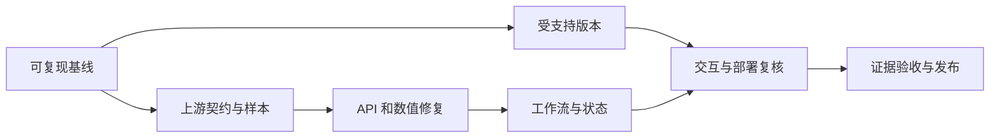

# bwg-usage 项目全面分析与改进方案

历史审查资料，各项证据对应文中日期与提交，不代表当前配置要求。
当前功能与部署方式见 [README](../README.md) 和 [部署说明](DEPLOYMENT.md)。

审查日期：2026-10-05。审查基线：`c9369b8`。第 1–11 节记录改造前的证据与方案。
后续用户授权实施，选定 React 最新版、vinext 和 Vercel；实施进度见第 12 节。

## 1. 结论与适用范围

项目是单台 VPS 的流量监控与启停面板，保留单体和 App Router 结构。
优先工作是升级受支持版本、保证数据可信、避免重复管理操作、建立可复现的质量检查。
微服务、通用插件框架、数据库、分布式缓存和大规模重写，均缺少当前需求依据。

你已确认使用场景为个人私用，面板可能通过公网访问。
主方案采用个人面板与受保护入口，不建设多用户平台。
审查阶段未取得完整 KiwiVM 契约；实施阶段已登录官方 API 页面核对，详情见第 12 节。

## 2. 团队与覆盖面

采用主协调加 4 个协作代理，分批承担专项职责，最多 4 个成员同时工作。
同一代理在完成一个专项后切换职责；下表表示审查分工，并非 11 个独立代理。
所有成员均以只读分析为主，没有调用真实 VPS 接口或执行启停操作。

| 职责 | 承担成员 | 交付范围 |
| --- | --- | --- |
| 总协调 | 主代理 | 证据归并、冲突处理、实施顺序与完整方案 |
| 安全审查 | security_audit | 密钥、信任边界、输入、跨域与操作安全 |
| 后端与领域审查 | backend_reliability_audit | 上游契约、异常、流量、日期与单位 |
| 前端审查 | frontend_audit | 状态竞争、交互、响应式与可访问性 |
| 架构审查 | architecture_audit | 模块责任、接口、重复代码与复杂度 |
| QA / CI / 开发体验 | backend_reliability_audit | 测试矩阵、工具链与检查门槛 |
| 运维审查 | frontend_audit | 部署、日志、请求预算、发布与回滚 |
| 产品审查 | security_audit | 现有工作流、场景差异与功能优先级 |
| 依赖与安全公告 | 主代理 | 锁文件、实际审计与官方支持政策 |
| 性能复核 | frontend_audit | 生产构建指标与有依据的优化方向 |
| 最终交叉复核 | architecture_audit | 优先级、证据限制与过度设计检查 |

应用了 codebase-design、vercel-react-best-practices、web-design-guidelines 与 shadcn 配置审查。
当前环境未提供 TeamCreate / TaskCreate 和 fast-context 工具，使用协作代理与本地检索替代。

## 3. 项目现状与实测基线

| 项目 | 已确认状态 |
| --- | --- |
| 规模 | 22 个已跟踪文件，13 个 src 文件，约 900 行源码与样式 |
| 技术栈 | Next.js 14.1.0 / App Router、React 18、TypeScript、Tailwind、NextUI |
| 页面 | 一个主页面；配置、监控与管理操作集中在 VPSCard |
| 后端 | POST /api/vps/info、POST /api/vps/action；固定代理 KiwiVM 上游 |
| 配置 | API Key 与 VEID 默认长期保存到 localStorage |
| 刷新 | 配置完成后每 30 秒刷新，没有显式并发与超时预算 |
| UI | 实际使用 NextUI；另有未被页面引用的 shadcn 风格组件与 CSS 模块 |
| 工程基础 | 有 strict TypeScript；没有仓库内测试、README、ESLint 配置或 CI 工作流 |

最初仓库没有本地 node_modules，直接检查调用了全局 Next/TypeScript，结果不作为项目结论。
Next lint 曾触发依赖自动安装，已停止；检查后已跟踪文件没有变化。
正式验证在 `/tmp/bwg-usage-audit.TLwo1Y` 的 HEAD 隔离副本进行：
通过 Bun 将原 bun.lockb 导出为 Yarn 锁，再用 pnpm import 转换，冻结安装并禁用安装脚本。
版本核对包含 Next 14.1.0、React 18.3.1、TypeScript 5.7.3、NextUI 2.6.11。

| 检查 | 实际结果 | 解释 |
| --- | --- | --- |
| pnpm exec tsc --noEmit --incremental false | 通过 | 隔离副本的本地 TypeScript 检查 |
| pnpm build | 通过 | Next 14.1.0 的完整生产构建 |
| CI=1 pnpm lint | 未完成 | 虽退出码为 0，但只出现 ESLint 初始化选择，没有实际 lint |
| 首页 First Load JS | 172 kB | 构建报告；页面部分 84.5 kB，共享部分 84.2 kB |
| 生产静态 HTML | 主面板为空 | 构建产物中 main 无子内容，未包含标题或配置外壳 |
| pnpm audit --prod --json | 返回告警 | 元数据：严重 3、高危 30、中危 24、低危 6，共 63 |
| 实际路由故障注入 | 已完成定向探测 | 将真实 route.ts 转译后运行，上游与 NextResponse 使用本地替身 |
| 浏览器、移动端、性能体验 | 未验证 | 没有 ego-browser 操作，也没有 TypeSafe 实际验收结果 |
| 线上部署、访问策略与日志 | 未审查 | 仓库之外的保护和基础设施未知 |

构建通过不表示 lint、业务正确性、安全性或浏览器验收通过。
63 是依赖审计的告警统计，不表示存在 63 条可在本项目利用的攻击路径。
补充产物测量：最大路由依赖 chunk 为 81,506 gzip 字节，页面入口为 3,205 gzip 字节；
CSS 为 25,523 gzip 字节，预加载 Latin Inter 字体为 48,432 字节。
这些采用 Node 默认 gzip，不能直接与 Next 构建报告混用，也不能代表实测 LCP/CLS/INP。

## 4. 优先级定义

- P0：若准备公网运行，应作为发布前置条件处理。
- P1：本轮稳定性改造必须解决，影响正确性、操作安全或检查可信度。
- P2：与 P1 一并实施的体验和维护改善，或按部署条件启用。
- P3：取得测量或实际需求后实施，避免推测性建设。

## 5. 关键发现与针对性方案

### A01. 框架版本已失去支持，且命中安全公告

优先级：P0 公网发布，其他场景 P1。证据：package.json:21、32 与实际依赖审计。
官方支持政策已将 Next 14 列为不受支持版本；截至审查时 Next 最新为 16.3.8。
2026-09-30 官方安全发布列出 16.3.8 和 15.5.27；实施时须重新核对当前受支持补丁。
建议目标为受支持的 Next 16，同时核对 React、类型、ESLint 和 UI 库兼容性。
Next 14.2.35 只是历史部分问题的修复版本，不应作为本次最终升级目标。
NextUI 已被包注册表标为弃用；可以评估兼容的 HeroUI 升级路径，不把 UI 重设计绑到升级上。
验收：受支持运行时下冻结安装、类型、实际 lint、测试、生产构建与关键交互都通过。

审计中的严重告警需要核对条件：中间件鉴权绕过要求相关鉴权配置，本仓库没有 middleware；
Windows RCE 要求 Windows 部署，当前本地环境是 macOS；AVIF 告警要求对应图像优化路径。
这些条件未在部署环境验证。App Router DoS 公告则与当前路由架构相关，应优先处理。
不能把 Next 14 stable 误报为 2025 年 React2Shell 的受影响版本。

### A02. pnpm 工作流没有匹配锁文件，lint 存在假成功

优先级：P1。证据：仅有 bun.lockb；package.json:5、9 缺少运行时锁定与检查配置。
先保留现有解析版本转换为 pnpm-lock.yaml，再在独立步骤升级依赖，减少不可解释变化。
明确 packageManager 与 Node 版本；提供 typecheck、test 和真正非交互的 lint 命令。
Next 16 不沿用 next lint，需配置相容 ESLint 命令；ESM 的 next.config 可改为 .mjs。
不要直接全局设置 type=module，因为现有 Tailwind/PostCSS 配置使用 CommonJS。
验收：新环境冻结安装与完整检查成功；配置缺失和锁漂移返回失败，不能只显示初始化提示。

### A03. 输入只检查真假值，且上游参数直接拼接

优先级：P1。证据：info/route.ts:65、75；action/route.ts:7、24。
对象和布尔值也能通过参数检查；特殊字符可制造重复参数或截断值。
采用小型共享解析函数：JSON 对象、字符串类型、非空、合理长度、确认过的 VEID 格式。
保留 action 白名单，用 URL / URLSearchParams 构造请求；不要臆造 API Key 正则。
区分无效 JSON、错误类型和不支持的 Content-Type；在调用上游前拒绝无效输入。
验收：非法输入零上游请求；特殊字符仍是一个完整参数值，不能改变查询结构。
固定 API_BASE 和操作白名单意味着本次未证明任意主机 SSRF。

### A04. 没有验证上游响应，成功响应可能含无效数据

优先级：P1。证据：info/route.ts:14、15、20、34；VPSCard/index.tsx:266。
真实路由探测证实，缺失计数字段仍返回 200，内容包含 NaN 字符串、null 百分比和 Invalid Date。
非数组 IP 可使 .join 调用异常；缺失信息被默认为 0 或 false，混淆未知与真实零值。
在服务端集中校验必需字段；可选缺失字段使用 null，拒绝非有限数字与不合法结构。
只严格校验当前消费的字段和错误契约，容忍无关新增字段，不把未展示的可选字段全部设为必需。
区分有限额度、额度未知和供应商确实支持的不限量语义，不自行推定 0 的含义。
验收：异常响应产生受控错误，页面无异常、NaN、Infinity 或伪造的零值。

### A05. 错误类别被折叠，超时没有预算

优先级：P1。证据：两条 route 的 fetch/json/catch；src/lib/api.ts:4、24。
定向探测证实，客户端无效 JSON 返回 500，上游 503 HTML 也变成通用 500。
引入稳定错误码，例如 INVALID_INPUT、UPSTREAM_TIMEOUT、INVALID_UPSTREAM_RESPONSE。
客户端输入错误与上游 HTTP、业务错误、解析错误分别处理；确切鉴权映射依据供应商契约。
设置上游和客户端截止时间，总预算低于部署平台限制；查询起始预算可评估 8–10 秒。
查询仅对确认的瞬时网络/5xx/429 错误重试，起始上限一次，并遵守 Retry-After 和总预算。
凭证错误、格式错误与 schema 失败不重试；管理操作超时不得自动重发。
验收：无效输入 400、错误上游数据 502、上游超时 504；操作结果不明时明确标注未知。

### A06. 刷新和启停共用状态，存在并发竞争

优先级：P1。证据：VPSCard/index.tsx:97、112、140。
固定间隔无视前一请求是否完成，旧响应可以覆盖新数据；查询结束可以提前清除操作 busy。
分离首屏加载、后台刷新和 pendingAction，拆开查询错误与操作错误。
每个视图最多一个查询，结束后再调度；使用取消信号和请求代次防止旧响应回写。
操作期间协调轮询，重置/换配置/卸载时取消查询并让旧代次失效。
管理请求一旦送达上游，取消客户端等待不代表撤销操作；须保留原目标和未知结果。
验收：反序响应不覆盖新值；后台查询不解锁操作；双击确认只发送一次命令。

### A07. 管理请求成功不等于 VPS 已完成操作

优先级：P1。证据：VPSCard/index.tsx:118、153；types/index.ts:24。
动作响应被丢弃，随后只查普通信息；当前 DTO 不包含实际运行/停止状态。
保留提交结果，区分已受理、验证中、已确认、失败、结果未知。
成功提交但刷新失败，应显示这两个事实；无法取得运行状态时只声明请求受理。
现有停止/重启警告弹窗保留，补充当前主机名与 VEID，绑定确认时的目标身份。
打开弹窗时固定动作与目标快照；编辑/重置配置必须关闭弹窗或使旧确认失效。
提供即时互斥；公网部署再按需限制同一目标的并发操作。
验收：弹窗取消零命令；超时不重发；查询失败不把已受理的命令伪装为操作失败。

### A08. API Key 默认永久保存在浏览器

优先级：P1，严重程度取决于共享设备与页面暴露。证据：VPSCard/index.tsx:49、136。
默认使用内存会话；持久化作为明确选项，存储失败提供可继续的会话模式。
内存模式需要刷新后重新输入，减少保留时间但不防范当前页面中的恶意同源脚本。
sessionStorage 只能减少保留时间，不能阻止同源脚本读取；浏览器端加密不当作根本防护。
迁移旧持久化数据必须说明去留，不能静默延续永久保存；重置配置不等于撤销供应商密钥。
个人自托管可选择服务端环境密钥，但页面与 API 必须先有有效访问控制和目标限制。
验收：默认刷新后不保留密钥；存储异常不崩溃；构建产物、HTML、日志不含测试密钥。
未发现应用代码中的可利用 XSS，也未证明密钥已泄漏。

### A09. 公网代理需要明确访问边界，CORS 设置不合理

优先级：公网发布 P0，受保护私网 P2。证据：两个 POST route；next.config.js:8、9。
调用者仍须提供供应商凭证，因此没有登录不等于别人能直接操作你的 VPS。
但是公网调用者可消耗部署资源；个人面板优先使用现有反向代理鉴权或 VPN，覆盖页面和 API。
设置请求体和频率上限；同源应用移除宽泛 CORS，确需跨域才配置明确来源与预检。
Origin 检查不替代鉴权；在多实例部署前不引入分布式限流存储。
网关认证使用 Cookie 时，核对 Secure、HttpOnly 与符合登录流程的 SameSite，
管理请求验证允许的 Origin/CSRF 策略；来自未许可网站的请求必须零上游操作。
验收：未授权访问被拒绝、超限返回 429、超大请求被提前拒绝、合法同源流程可用。
通配 CORS 与 credentials=true 不能正常用于凭证式跨域读取，也不会开放他站 localStorage。

### A10. 单位、日均、日期、零值和超额显示不准确

优先级：P1/P2。证据：info/route.ts:20、24、41、48；VPSCard/index.tsx:280、307。
1024³ 转换应标为 GiB；若采用十进制 GB 则使用 1000³，先确认原始单位。
setMonth 推断前一个月存在溢出；已复现 2026-03-31 减一月得到 2026-03-03。
日均需要权威周期开始时间；若无法取得，标为估算或暂不展示，不能只修日期函数就声称准确。
服务端返回数字、UTC 时间戳和明确缺失值，前端统一格式化并显式选择展示时区。
百分比保留实际值，只限制进度条几何长度；0 天显示 0，未知显示未知。
验收：固定时间测试覆盖闰年、月底、重置前后、零额度、缺失、超额与不同部署时区。

### A11. 旧数据、初始占位与新数据不可区分

优先级：P2。证据：VPSCard/index.tsx:69、103、280、351。
使用 data=null 与稳定首屏占位，避免未获取数据时显示 0% 使用量。
记录最近成功更新时间，失败保留旧数据但标为过期；提供手动刷新与独立查询反馈。
时间戳表示取得该响应的时间，不冒充供应商提供的精确测量时间。
验收：未加载、最新、过期、离线与失败都有明确表示；刷新不让启停按钮同时显示操作 spinner。

### A12. 配置纠错依赖清空与整页刷新

优先级：P2。证据：VPSCard/index.tsx:127、136；page.tsx:6。
设置一个凭证状态拥有者，统一加载、校验、保存、编辑与重置，移除重复解析。
先验证候选配置，再替换已工作的配置；失败保留输入，避免错误密钥把用户困在面板。
换 VEID 后旧数据立即失效；重置本地状态而非强制页面 reload。
验收：能纠正错误配置，存储不可用仍可查询，旧主机信息不会作为新主机当前数据显示。

### A13. 超大组件降低修改和验证可靠性

优先级：P2。证据：VPSCard/index.tsx:40–404，文件约 466 行。
主函数承担几乎全部功能，明显超过约定的 50 行函数限制，并逼近 500 行文件限制。
按责任抽出凭证表单、仪表盘控制、数据展示、确认弹窗和服务端供应商模块。
普通函数注入 fetch 与时钟即可满足可测试性，无需 DI 容器或类层级。
验收：文件小于 500 行、函数小于 50 行；修改计算、传输或展示不会波及无关流程。

### A14. UI 配置、主题与冗余需要收敛

优先级：P2/P3。证据：components.json:7；providers.tsx:9；globals.css:6；VPSCard:234。
shadcn 配置 CSS 路径应为 src/app/globals.css；现有实际 UI 是 NextUI。
本轮优先保留正在使用的 UI，统一语义色；选择明确仅浅色或完整深色支持，不留半套主题。
确认无引用后再规划清理本地 button/card/utils、未使用 CSS 与依赖；清理不等于必然减少首屏包。
lucide 已在依赖中，复用其图标可以代替本地 3 个重复 SVG 函数。
验收：实际使用路径、主题与工具配置一致；支持的主题下表单、弹窗、文字和焦点均可辨认。

### A15. 移动端与可访问性有静态风险

优先级：P2。证据：VPSCard/index.tsx:235、297、318、351、357。
固定三列、长主机名与多层内边距带来窄屏风险；目前没有实际截图证明已发生溢出。
调整响应式列数与文本换行；错误/结果添加适当的 alert/status；提供页面 h1 与装饰图标隐藏。
配置 reduced-motion；保留 UI 库原有按钮语义和弹窗焦点机制，实测后再认定缺陷。
验收：320/375/768/1440 宽度、200% 缩放、长主机名/IPv6、键盘和减少动画偏好都可用。
浏览器验收须同时取得 ego-browser 页面证据及 TypeSafe 实际判断，当前未完成。

### A16. 操作与异常缺少可诊断记录

优先级：P2。证据：info/route.ts:97；action/route.ts:44。
使用部署平台已有日志，记录 requestId、路由、动作、结果、上游状态与耗时。
禁止记录请求体、API Key 或完整带密钥的上游 URL；异常只记录经过脱敏的必要内容。
显式设置敏感响应 no-store；当前未证明 Next POST route 存在缓存泄漏。
按实际部署配置 HTTPS、防嵌入、nosniff 与 Referrer-Policy，CSP 需兼容框架后渐进启用。
验收：模拟故障可按请求 ID 定位；测试密钥不出现在日志；实际部署响应头正确。

### A17. 轮询与性能优化应从实际成本出发

优先级：P2/P3。证据：VPSCard/index.tsx:140；构建 First Load JS 172 kB。
持续活跃的单标签页约 2,880 次查询/天；100 个持续活跃标签页约 288,000 次/天。
隐藏/离线暂停，恢复时刷新，失败退避，确保查询不重叠；供应商限额确认后决定间隔。
先改善首屏空白与请求调度，再测量 UI、动画与弹窗的包成本。
空白首屏已由生产 index.html 证实；NextUI/Framer Motion 声明 sideEffects=false，
不能仅因 barrel import 就认定整库进入页面。升级后建立新基线，再逐项做同版本比较。
没有大列表或昂贵计算，不应全面添加 memo/useMemo，也不承诺未经测量的字节收益。
next/font/google 引入构建时字体网络依赖；本次构建成功，按部署限制评估系统/本地字体。
验收：隐藏/离线无定时请求；首屏有稳定外壳；记录相同环境的优化前后包大小与体验指标。

### A18. 缺少回归保护和最小发布说明

优先级：P1/P2。证据：无测试、README、仓库 CI；package.json:5。
建立领域计算、路由契约、定时器竞争和关键操作测试；避免对简单 JSX 或实现细节重复断言。
增加冻结安装、实际 lint、typecheck、test、build 的 CI；确认是否已有外部流水线，避免重复。
README 只说明必要的环境、运行、凭证策略、模拟数据、部署边界与故障处理。
当前 .gitignore 未覆盖全部 .env.production/.env.development 变体；无已发现泄漏，作为预防修正。
验收：新环境可重现完整检查，失败不会假绿；健康检查无需真实密钥或供应商请求。

## 6. 最小目标结构

```text
src/types/index.ts                         凭证、动作、数值 DTO 与错误契约
src/lib/api.ts                             浏览器 HTTP 调用与取消
src/lib/credentials.ts                     凭证解析与保留策略
src/lib/server/bwg.ts                      上游 URL、超时、解析与错误归类
src/lib/server/vps-data.ts                 纯计算与供应商数据标准化
src/components/VPSCard/index.tsx           小型组合入口
src/components/VPSCard/useVpsDashboard.ts  查询/动作/凭证生命周期
src/components/VPSCard/CredentialForm.tsx  配置输入与纠错
src/components/VPSCard/VpsOverview.tsx     真实数值、状态、更新时间展示
src/components/VPSCard/ActionDialog.tsx    目标明确的确认
src/app/api/vps/{info,action}/route.ts      校验请求与映射 HTTP
src/app/page.tsx                           页面外壳
```

这是职责示意，实施时可合并过小模块，不要求一函数一文件。
服务端对外只需 getServiceInfo(credentials) 与 execute(action, credentials)。
控制逻辑暴露 state、saveCredentials、reset、refresh、execute；展示层不管理持久化。
先定义必要 DTO/错误契约，再按功能拆分；行为修复与无关重构分别保持可审阅。

## 7. 场景取舍

针对你的场景，推荐现有访问网关/反向代理认证 → Next 应用 → KiwiVM 上游的部署形式。
公网仅开放受保护入口，应用端口监听私有地址或受网络策略限制，避免绕过入口直接调用 API。
若采用代理身份头，入口必须清理客户端同名头并限制直连，不能信任任意请求提供的身份。
第一阶段保留现有凭证配置工作流，默认内存保存；访问保护同时覆盖页面和两条 API。
若需要刷新后免输入，可另外选择服务端环境密钥模式：禁止 NEXT_PUBLIC 前缀、固定允许目标、
先完成鉴权与防直连，再开放操作。无需为一位使用者创建账户数据库。

| 场景 | 必须具备 | 额外投入 |
| --- | --- | --- |
| 本机/受保护私网，单人 | 数据正确、操作安全、密钥策略、明确私网入口 | 不需要账户和数据库 |
| 公网个人面板 | 上述能力加页面/API 鉴权、HTTPS、限流与浏览器保护 | 现成访问网关约 0.5–2 人日 |
| 匿名多人自带密钥 | 明确不长期托管密钥、滥用限制、用户数据隔离 | 不必仅因多人访问就强行加账户 |
| 托管账户与密钥的产品 | 登录、所有权校验、租户隔离、受控密钥保管与审计 | 单独需求与方案，约 1–3 周起 |

现有 suspended/policy_violation 是账户/服务告警，不是开机状态；先校验后正确展示。
剩余额度与手动刷新贴合当前工作流。复制 IP 可以作为低成本增强，但不是稳定性前置条件。
多 VPS、历史图表、后台告警、导出与团队权限，按真实使用需求立项，均不纳入核心交付。
现有 80% 变色只属于页面提示，不代表离线后台监控或消息告警能力。

## 8. 实施阶段与依赖

估计基于熟悉 React/Next.js 的工程师，包含定向测试，阶段之间有交叉，不能相加各专项估计。

| 阶段 | 交付与关联项 | 依赖 | 工作量 | 完成门槛 |
| --- | --- | --- | --- | --- |
| M0 基线 | 规范锁文件、运行时、实际 lint、样本与公网入口方案；A02/A09/A18 | 无 | 0.5–1 人日 | 新环境可复现，lint 不假绿 |
| M1 安全版本 | Next/React/ESLint/UI 兼容升级；A01 | M0 | 1.5–3 人日 | 受支持版本检查与构建通过 |
| M2 API 与数据 | 输入/响应校验、超时、错误、准确数值；A03–A05/A10 | M0；契约样本 | 2–3 人日 | 异常不会成功伪装或无界等待 |
| M3 工作流 | 状态并发、动作反馈、凭证与配置；A06–A08/A11–A13 | M2 的 DTO/错误约定 | 2–3 人日 | 无重复操作、旧响应与配置可纠正 |
| M4 UI 与运维 | 响应式/可访问性/轮询/日志/访问策略；A09/A14–A17 | M1/M3 | 1–2 人日 | 关键状态可用、可诊断、访问受控 |
| M5 发布验收 | CI、README、浏览器证据、发布记录；A18 | 以上阶段 | 1–2 人日 | 发布检查无未完成关键项 |

核心工作量约 8–14 人日；2–3 人合理并行后约 1–2 周，受接口证据和验收环境准备影响。
公网鉴权集成及真正的账户产品按上表另计。若必须更换 UI 大版本，单独估算兼容改造。



实现分工建议：API/领域负责人修改服务端与 DTO；前端负责人修改控制逻辑与视图；
质量负责人修改测试、脚本和 CI。共享类型先约定一位负责人，避免多代理并发修改同一文件。
工具链/依赖升级与 API 改造可在独立提交并行；合并前统一验证兼容性。

## 9. 验收矩阵

| 层级 | 关键用例 | 必须观察到的结果 |
| --- | --- | --- |
| 输入 | 无效 JSON、null、数组、对象/布尔凭证、空白、非法动作 | 受控 4xx；零上游请求 |
| URL | 带 &、# 等字符的合成值 | 参数正确编码；固定主机与动作范围不变 |
| 上游 | 成功样本、缺失字段、IP 错型、数字/标志类型变化 | 有效 DTO 或明确错误，无 NaN/页面异常 |
| 传输 | 429、5xx JSON/HTML、空响应、连接错误、超时 | 分类明确、总耗时有界、有限查询重试 |
| 数值 | 已知字节、零、缺失、负数、超额、舍入 | 单位一致，未知不同于零，实际超额保留 |
| 日期 | 固定 now、月底、闰年、零天、过期、时区 | 符合已约定周期/时区，不能出现溢出误算 |
| 并发 | 反序返回、慢查询、操作中刷新、卸载/重置 | 不回写过期代次；查询/动作状态独立 |
| 管理 | 取消、双击、受理后刷新失败、响应丢失 | 零或一次预期命令；失败与未知不混淆 |
| 凭证 | 错配置、损坏存储、禁用存储、编辑/重置 | 可恢复，不混用目标，不意外保留密钥 |
| 安全 | 无授权、超大请求、超频、日志密钥标记 | 正确拒绝与脱敏，不暴露服务端密钥 |
| UI | 初始、最新、过期、离线、失败、受限服务 | 不假装零使用量/已开机；状态与目标明确 |
| 浏览器 | 移动/桌面、长文本、键盘、缩放、减少动画 | 无遮挡/溢出，关键交互与信息可访问 |
| 部署 | 生产启动、响应头、健康检查、故障定位 | 不用真实 VPS 操作做 smoke；可定位与恢复 |

可用 Vitest + React Testing Library/jsdom 承担计算、路由和组件状态测试。
DOM 模拟测试不等同于浏览器验收；不要用 Playwright/Cypress 替代你的浏览器规范。
每个浏览器用例必须由 ego-browser 操作并采集页面状态，再以验收条件和证据发起真实
TypeSafe API 请求，检查并保存结果。API 调用失败或证据不足，标记未完成验证。
保存用例 ID、期望、截图/DOM、脱敏请求证据、实际 TypeSafe 判断，不上传密钥到判断服务。
确定性数值和命令次数仍由明确断言验证，TypeSafe 不替代这些断言。

本轮真实路由探测结果：

| 用例 | 当前观察结果 | 模拟上游调用次数 |
| --- | --- | --- |
| 无效 JSON / null，请求两条 route | 500 通用错误 | 0 |
| 对象/布尔凭证，两条 route | 仍调用上游 | 每次 1 |
| 上游 503 HTML，两条 route | 500，丢失上游错误类别 | 每次 1 |
| info 上游缺失计数字段 | 200；NaN、null、Invalid Date | 1 |
| action 不支持的动作 | 400，正确拒绝 | 0 |

这些是对真实源代码的本地定向探测，所有 fetch 均被替身替换，不是完整测试套件。

## 10. 发布、回滚与完成标准

发布顺序：冻结安装与完整检查 → 模拟上游的受限预览 → 浏览器实际验收 → 发布同一构建产物。
检查真实入口保护、HTTPS、响应头与脱敏日志。探活无需密钥，不调用供应商。
记录版本与一个已知安全的回退产物；不要回滚到已知存在未修复风险的旧版本。
应用回滚不能撤回已受理的 VPS 操作；结果不明先通过供应商状态证据判断，再采取人工措施。
实际修改、删除旧模块/依赖或清理持久化数据时，遵循你要求的破坏性操作确认规则。

核心完成标准：受支持依赖；冻结工具链；准确数字；有界查询；无非预期重复命令；
可纠错配置；数据新旧明确；访问边界明确；实际 lint/测试/build 通过；关键浏览器验收证据完整。

## 11. 外部证据与待确认事项

官方资料：

- Next 支持政策：https://nextjs.org/support-policy
- 最新已核对安全发布：https://nextjs.org/blog/september-2026-security-release
- App Router DoS 与历史补丁：https://nextjs.org/blog/security-update-2025-12-11
- React2Shell 受影响版本说明：https://nextjs.org/blog/CVE-2025-66478
- 依赖审计原始 JSON：`/tmp/bwg-usage-audit.TLwo1Y/dependency-audit.json`

待确认：具体托管与入口保护；字段/错误原始样本；周期开始和重置时区；不限量表示；
流量倍率语义；供应商配额；动作受理/完成/重试约定；只读运行状态字段；现有外部 CI。
浏览器与 TypeSafe 环境是否可用，将影响最终验收排期；本轮没有宣称浏览器测试通过。

## 12. 实施结果与发布前事项

更新日期：2026-10-05。以下记录用户授权后的实际改造；第 1–11 节仍是旧版审查快照。
最终目标为个人公网面板、Vercel、应用内密码登录；已替换此前的 Cloudflare 部署配置。
实施按工具链、API/领域、工作流、安全与验收推进，各专项在职责边界内并行交叉复核。

### 12.1 逐项状态

| 项目 | 已实施结果 | 验证或限制 |
| --- | --- | --- |
| A01 | React/DOM/RSC 19.3.0、vinext 1.0.1、Vite 8.3.2、HeroUI 2.8.10 | Node/Vercel 构建；Nitro 为 beta |
| A02 | pnpm 锁文件、Node 22、实际 ESLint、类型检查与统一检查命令 | 冻结安装与完整检查通过 |
| A03 | JSON/类型/长度/动作白名单、请求体上限、固定 HTTPS 表单 POST | 非法输入和编码契约测试 |
| A04 | 校验供应商字段，数值未知用 null，拒绝非有限数字 | 异常样本与 DTO 契约测试 |
| A05 | 有界超时、取消、错误分类；基本查询最多重试一次 | live 与操作零自动重试 |
| A06 | 查询和操作独立、请求代次、取消与同步操作锁 | 反序响应、双提交与操作暂停测试 |
| A07 | 区分受理、拒绝、未知；弹窗固定目标，之后核对 live | 重启不凭 Running 宣称完成 |
| A08 | 默认内存、明确保存、旧配置确认、可选服务端凭证 | 持久化/刷新/密钥隔离验证 |
| A09 | 密码登录、精确 Origin、受保护页面/API、Upstash 分布式限流 | 编译产物通过；线上配置待落实 |
| A10 | 字节 DTO、GiB、倍率、UTC 月末钳制、日均明确估算 | 月末/闰年/零/未知/超额测试 |
| A11 | 成功时间戳、独立查询错误、保留旧数据并标为过期 | 失败与恢复浏览器验收 |
| A12 | 验证候选配置再替换、可编辑取消、状态重置 | 配置错误、取消与目标切换测试 |
| A13 | 拆分配置、查询调度、操作、视图与服务端责任 | 源码文件/函数尺寸检查 |
| A14 | HeroUI 与 Lucide、浅色主题、移除未引用模块和旧配置 | 生产构建与弹窗交互验收 |
| A15 | 响应式换行、语义反馈、中文关闭名称、减少动画 | 四档宽度/键盘通过；原生缩放待验 |
| A16 | 脱敏请求编号、错误码、耗时、no-store、安全响应头 | 日志隔离与实际响应头验证 |
| A17 | 隐藏/离线暂停、退避、避免重叠、SSR 外壳、按需弹窗 | 调度测试；未宣称 Web Vitals 改善 |
| A18 | 196 项回归测试、冻结安装 CI、README、Vercel 离线验证 | 本地通过；未执行线上发布 |

### 12.2 官方契约核对

已在登录浏览器中核对 KiwiVM API 菜单，不复制或展示真实 API Key：
通用入口为 https://kiwivm.64clouds.com/，登录自己的 VPS 后进入 API 菜单。

- `plan_monthly_data` 与 `data_counter` 都乘 `monthly_data_multiplier`，缺失倍率取 1。
- 重置时间为 Unix 时间；没有权威周期开始字段，日均只能标为估算。
- `suspended`、`policy_violation` 不代表电源状态；KVM 状态有 Starting/Running/Stopped。
- live 可能耗时 15 秒；普通查询限时 10 秒，live/操作限时 20 秒。
- 管理响应 `error: 0` 只证明受理；超时或无法识别的响应不能证明失败或完成。

### 12.3 工程与产物验证

| 检查 | 实际结果 |
| --- | --- |
| `pnpm install --frozen-lockfile` | 通过 |
| `pnpm check` | ESLint、TypeScript、196 项测试与 Node 构建通过 |
| `pnpm build:vercel` / `pnpm verify:vercel` | 最终产物重建与编译后集成复核通过 |
| 文件/函数/行长、`git diff --check` | 通过；测试分组回调不计业务函数 |
| 编译后认证验证 | 真实登录签发与签名、8 小时 Cookie、退出过期、匿名/伪造/跨站拒绝 |
| 编译后限流验证 | 实际 SDK 加离线 Redis 传输桩；网络/HTTP/超时拒绝、429、零真实上游请求 |

本轮 Node 构建的 gzip 样本：VPSCard 26,969 字节、按需 ActionDialog 8,433 字节、
CSS 29,747 字节。它们不是首屏总量，构建管线不同，也不能直接换算为旧版的性能提升。

### 12.4 浏览器证据

使用同一个 ego-browser TaskSpace 27；每个完成的用例均取得真实 TypeSafe API 判断。
证据与截图位于 `/tmp/bwg-usage-validation`，模型实际返回 `jev-1.13.0`。

| 用例 | 关键页面证据 | TypeSafe 判断 |
| --- | --- | --- |
| 01–05 | 默认遮蔽与不保存；20/100 GiB；120%；失败旧数据；零额度恢复 | pass，恢复补采前后状态 |
| 06–09 | 取消零命令；受理诚实提示；未知不重发；配置取消 | pass |
| 10–11 | 勾选前后与保存匹配；刷新提供复用/删除，查询和操作均为零 | 补采后 pass |
| 12 | 320/375/768/1440 实测宽度，长主机名/IPv6，无水平溢出或文字裁切 | 四档均 pass |
| 13–15 | CSS zoom=2 的重排；Tab 留在弹窗、Escape 恢复焦点；减少动画 CSS | pass，非原生浏览器缩放 |
| 16 | 操作期间编辑禁用、focus 零查询、受理后一次 live | pass |
| 17–18 | 模拟退出保留主动存储；模拟密码错误可重试且不保存密码 | pass |
| 19 | 无模拟拦截的本地预览显示初始表单、密钥遮蔽、保存未勾选 | pass |

历史 fail、证据不足和网络失败记录均保留，未计为通过；补采使用更明确的页面测量。
CSS 缩放与操作锁用例的 TypeSafe confidence 较低，另有确定性测量/回归断言支持。
浏览器用例使用编译后的 Node 页面和模拟 API；生产认证由上述编译验证承担。
一次重载丢失模拟拦截，合成凭证查询尝试访问上游并超时；没有真实密钥或启停命令。
随后测试服务器禁用外部网络；测试存储已清除，带拦截的页面已关闭。

### 12.5 发布前配置与剩余风险

1. 按 [README](../README.md) 设置固定 HTTPS `APP_ORIGIN`、密码、签名密钥及 Upstash 变量。
   推荐同时配置 `BWG_VEID` 与 `BWG_API_KEY`，仅服务端保管并固定管理目标。
2. Vercel 使用 Other 预设、Node 22 与仓库构建命令；Production/Preview 分别配置 origin。
3. 上线后验证真实域名、Redis 连通性、登录/退出和匿名拒绝；不以真实启停作为探活。
4. Nitro 3.0.260903-beta 的平台兼容需继续观察；vinext 构建链 `braces` 高危仍无补丁，
   未发现进入本项目 HTTP 请求路径；`fflate` 已通过 override 修补。
5. 原生浏览器 200% 缩放、屏幕阅读器与真实线上性能尚未验证；未提交、推送或部署线上。
